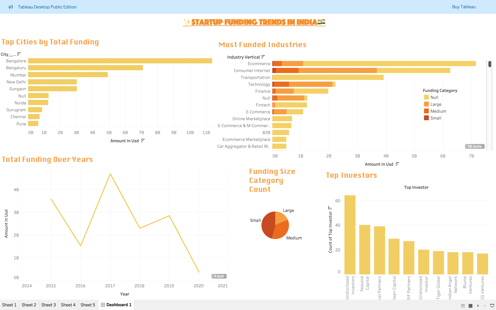

# 🚀 Startup Funding Analysis – India

This project analyzes startup funding trends in India using a publicly available dataset. It uncovers investment patterns across cities, funding categories, and top investors using **Python for preprocessing** and **Tableau for visualization**.

---

## 📊 Dashboard Preview

---

## 📁 Project Structure

| File/Folder                                | Description                                        |
|--------------------------------------------|----------------------------------------------------|
| `main.ipynb`                                | Jupyter Notebook with data cleaning + EDA         |
| `startup_funding_cleaned.xlsx`              | Cleaned dataset used for Tableau                  |
| `Startup_Funding_Dashboard.twbx`            | Tableau Packaged Workbook (Final Dashboard)       |
| `dashboard_preview.jpeg`                    | Screenshot of the dashboard for preview           |
| `README.md`                                 | Project overview and summary                      |

---

## 🔍 Key Insights

- **Bangalore**, **Delhi NCR**, and **Mumbai** are the top-funded startup hubs.
- **Small funding rounds (< $1M)** dominate the Indian startup scene.
- The most active investors include **Sequoia Capital**, **Accel Partners**, and **Blume Ventures**.
- **Technology and e-commerce startups** receive the highest funding share.

---

## 📚 Dataset Source

**Indian Startup Funding Dataset**  
📎 [Kaggle Link (Optional)](https://www.kaggle.com/datasets)

---

## 🛠️ Tools & Technologies

- **Python** (Pandas, Seaborn)
- **Tableau Desktop**
- **Jupyter Notebook**
- **Git & GitHub**

---

## 📌 Charts Included

- 📍 Funding by City (Bar Chart)
- 💰 Funding Amount Over Time (Line/Area Chart)
- 🧮 Funding Size Category Distribution (Pie/Bar Chart)
- 🏢 Top Investors by Frequency (Bar Chart)
- 🧠 Optional: Heatmaps, Filters, Actions, Annotations

---

## 👩‍💻 Author

**Divyanshi Sharma**  
4th Year BTech – Data Science & AI/ML Student  
🌐 [GitHub Profile](https://github.com/Divyanshi88)

---

🎯 *This project highlights data storytelling skills through financial analysis, dashboard design, and practical use of Tableau.*

